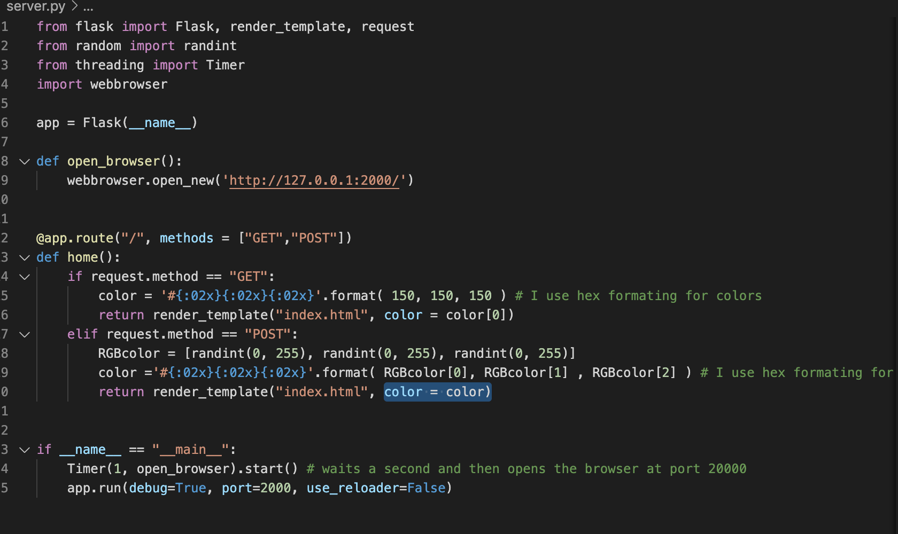
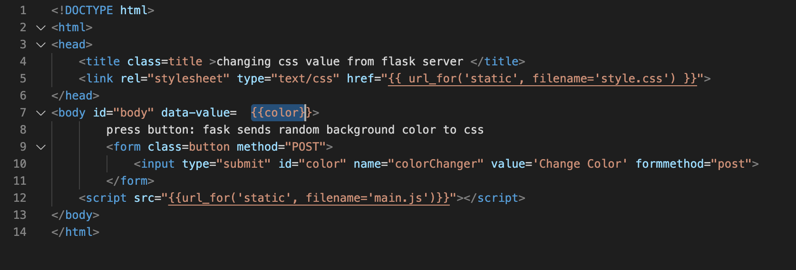
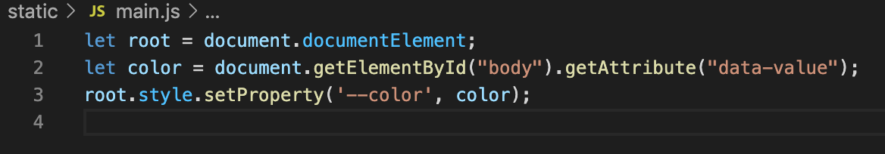
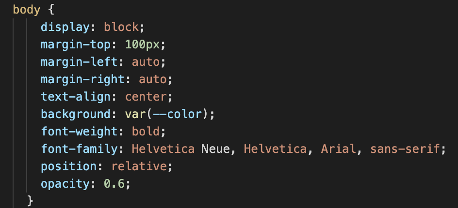

# Howto: send a data value from a flask server to a CSS property

Upfront, this is just a demo of a solution I once came up with and will not be maintained.

Also, I deliberately made a minimal complexity demo to distil only the essence of this idea and nothing more.

## Problem I was facing:

In a (static) REST API, I wanted to send a value from the flask server to a CSS variable. 

My problem: I wanted to keep all the style in the CSS file, all the scripts in JS file to have it organized. 

Sending a data value from flask into a HTML file is trivial, but I had difficulties sending it to the CSS file. If you face the same problem, here is one possible solution. There might be other, more elegant versions and I don't claim that this is the best, but it is one that works for me.

## Solution:

In short:

flask -> HTML (as data value) -> JS -> CSS

In essence, first, send the data value the HTML data-* attribute. 

The data value is send from flask to the HTML head tag.

This data-value will be read by the JS script. 

This same script then sets the CSS property accordingly, while the CSS file is set up such that it listens to the JS script. 

All in all, a detour, but it works.
 
 

 
